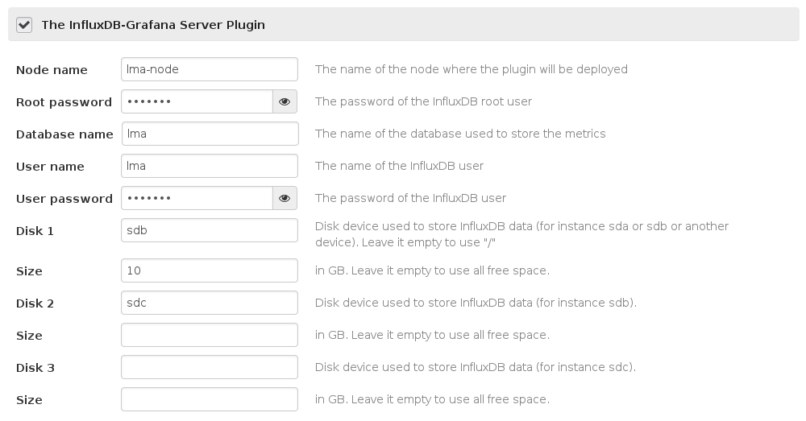

InfluxDB-Grafana Plugin for Fuel
================================

InfluxDB-Grafana plugin
-----------------------

Overview
--------

[InfluxDB](http://influxdb.com/) provides an open source time series database.
[Grafana](http://grafana.org/) is a rich dashboard and graph editor for InfluxDB.

Requirements
------------

| Requirement                      | Version/Comment |
|----------------------------------|-----------------|
| Mirantis OpenStack compatibility | 6.1 or higher   |

Recommendations
---------------

None.

Limitations
-----------

None.

Installation Guide
==================

**InfluxDB-Grafana** plugin installation
----------------------------------------


To install the InfluxDB-Grafana plugin, follow these steps:

1. Download the plugin from the [Fuel Plugins
   Catalog](https://software.mirantis.com/download-mirantis-openstack-fuel-plug-ins/).

2. Copy the plugin file to the Fuel Master node. Follow the [Quick start
   guide](https://software.mirantis.com/quick-start/) if you don't have a running
   Fuel Master node yet.

   ```
   scp influxdb_grafana-0.7-0.7.0-0.noarch.rpm root@<the Fuel Master node IP address>:
   ```

3. Install the plugin using the `fuel` command line:

   ```
   fuel plugins --install influxdb_grafana-0.7-0.7.0-0.noarch.rpm
   ```

4. Verify that the plugin is installed correctly:

   ```
   fuel plugins
   ```

Please refer to the [Fuel Plugins wiki](https://wiki.openstack.org/wiki/Fuel/Plugins)
if you want to build the plugin by yourself, version 2.0.0 (or higher) of the Fuel
Plugin Builder is required.

User Guide
==========

**InfluxDB-Grafana** plugin configuration
---------------------------------------------

1. Create a new environment with the Fuel UI wizard.
2. Add a node with the "Operating System" role.
3. Before applying changes or once changes applied, edit the name of the node by
   clicking on "Untitled (xx:yy)" and modify it for "influxdb".
4. Click on the Settings tab of the Fuel web UI.
5. Scroll down the page, select the "InfluxDB-Grafana Server plugin" checkbox
   and fill-in the required fields.
    - The name of the node where the plugin is deployed.
    - The password for the root user.
    - The name of the database where you want to store your metrics.
    - The username and the password for this specific database.

You can select up to 3 physical disks that will be mounted as a single logical
volume to store the InfluxDB data. If you specify no disk, the data will
be stored on the root filesystem. In all cases, InfluxDB data will be
located in the */opt/influxdb* directory.

For each disk, you can also specify the allocated size (in GB). If you don't
specify a value, the plugin will use all the free space of the disk.

Here is a screenshot of the fields



Testing
-------

### InfluxDB

Once installed, you can check that InfluxDB is working using `curl`:

```
curl -G 'http://<HOST>:8086/db/lma/series?u=lma&p=<yourpassword>' --data-urlencode "q=list series"
```

Where `HOST` is the IP address or the name of the node that runs the server and
`yourpassword` is the password provided in the Fuel UI for the user of InfluxDB.

The curl command should return a valid JSON object similar to:

```
[{"name":"list_series_result","columns":["time","sequence_number","name"],"points":[...]}]
```

### Grafana

To check that Grafana is running, you need to make sure that *nginx* is listening
on port 80. The user interface is available at:

```
http://$HOST/
```

**Note**: if you deploy this plugin on a node that is also running the
[Elasticsearch-Kibana plugin](https://github.com/stackforge/fuel-plugin-elasticsearch-kibana)
then *nginx* will use the port 8000 instead of 80. So in that case the user interface
is available at:

```
http://$HOST:8000/
```

Known issues
------------

None.

Release Notes
-------------

**0.7.2**

* Support for MOS 7.0.
* Fix wrong values in service dashboards ([LP#1488086](https://bugs.launchpad.net/fuel-plugins/+bug/1488086)).
* Execute the network configuration task only on the InfluxDB-Grafana node ([LP#1489885](https://bugs.launchpad.net/fuel-plugins/+bug/1489885)).

**0.7.1**

* Fix issues with licence.

**0.7.0**

* Initial release of the plugin. This is a beta version.

Development
===========

The *OpenStack Development Mailing List* is the preferred way to communicate,
emails should be sent to `openstack-dev@lists.openstack.org` with the subject
prefixed by `[fuel][plugins][lma]`.

Reporting Bugs
--------------

Bugs should be filled on the [Launchpad fuel-plugins project](
https://bugs.launchpad.net/fuel-plugins) (not GitHub) with the tag `lma`.


Contributing
------------

If you would like to contribute to the development of this Fuel plugin you must
follow the [OpenStack development workflow](
http://docs.openstack.org/infra/manual/developers.html#development-workflow).

Patch reviews take place on the [OpenStack gerrit](
https://review.openstack.org/#/q/status:open+project:stackforge/fuel-plugin-influxdb-grafana,n,z)
system.

Contributors
------------

* Guillaume Thouvenin <gthouvenin@mirantis.com>
* Simon Pasquier <spasquier@mirantis.com>
* Swann Croiset <scroiset@mirantis.com>
